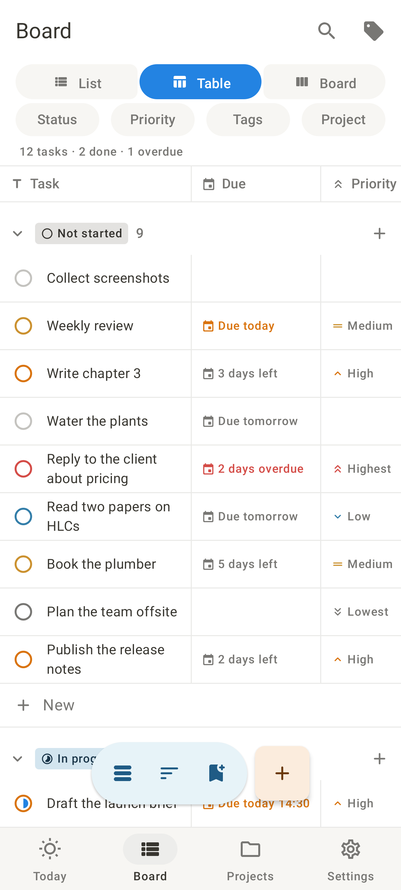
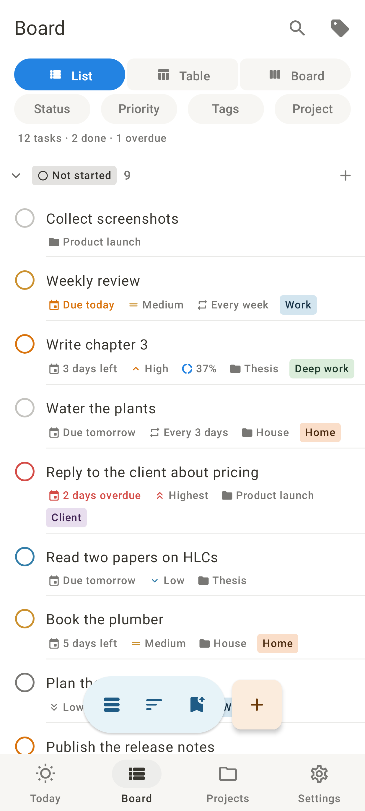
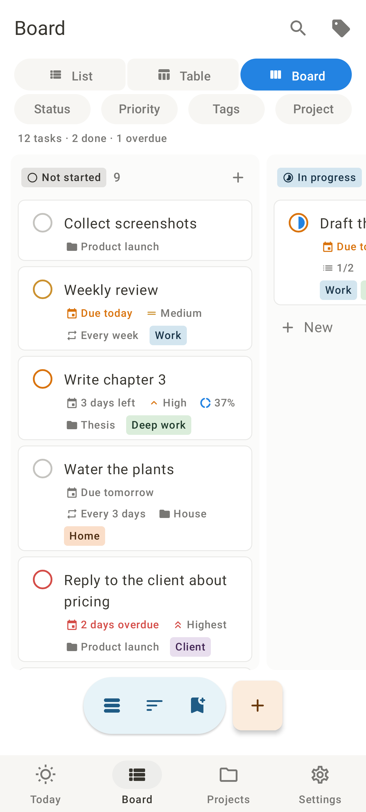
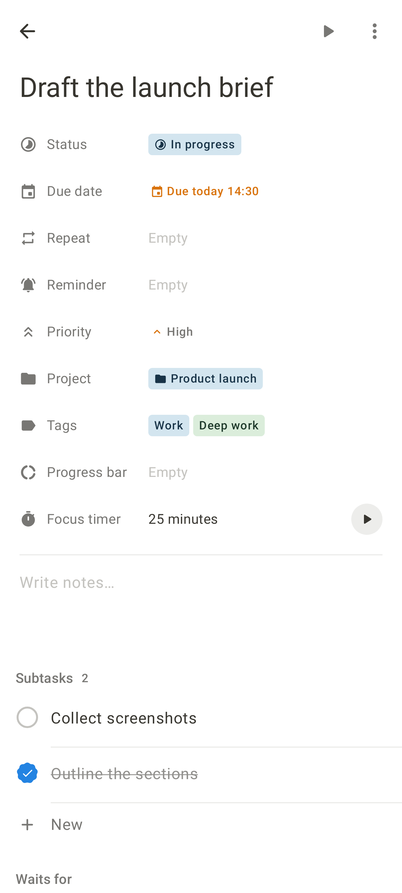
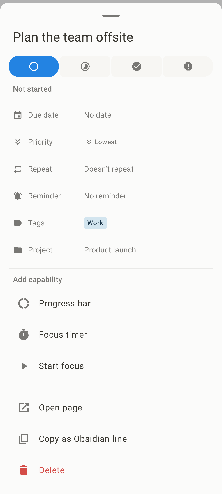
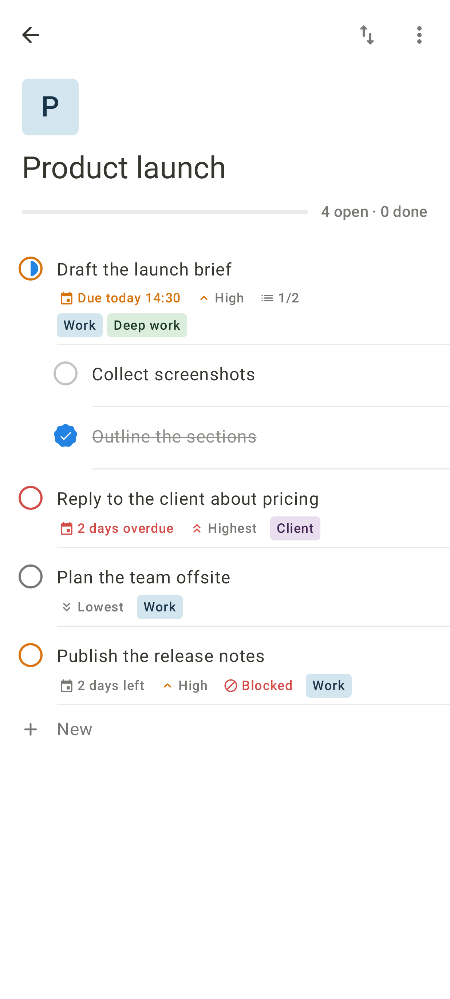
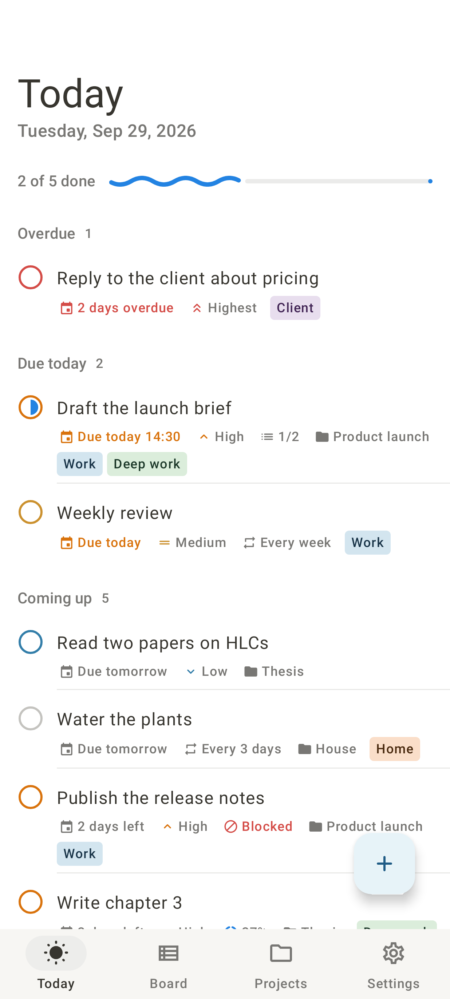
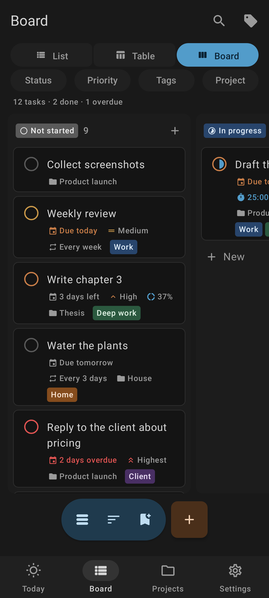
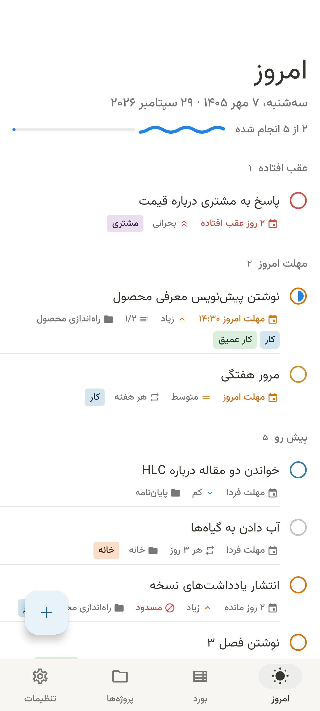

# Taski

**The TaskPro Obsidian plugin, as an Android app.** Every task capability the
plugin gives your vault — four-state statuses, five priorities, deadlines in the
Gregorian or Jalali calendar, repeats that roll forward, coloured tags, progress
bars, focus timers, a board of every task, and nagging reminders — built natively
with **Jetpack Compose and Material 3 Expressive**, in English and Persian.

It works fully offline and without an account. Its storage is already shaped for
a later sync with Supabase; see [docs/SYNC.md](docs/SYNC.md).

<p>



</p>
<p>



</p>
<p>



</p>

<sub>Rendered from the real app — Hilt graph, Room, navigation — by
`./gradlew :app:recordRoborazziDebug` (Robolectric native graphics), not mock-ups.</sub>

## From the plugin to the phone

| TaskPro plugin | Taski |
| --- | --- |
| `[ ]` `[/]` `[x]` `[!]` and the `Ctrl+T` four-state toggle | A checkbox that morphs through the four states; tap toggles done, long-press picks any status |
| Chips you click to change a property in place | Every property on a row is its own button: tap the date for the date picker, the priority for priorities, a tag for the tag picker; long-press a task for its whole sheet (status, every property, capabilities, focus, copy as Obsidian line, delete) |
| `@priority(highest…lowest)` with chevron icons | Same five levels, same icons, harmonised colours |
| `@due(2026-12-31)`, deadline chips (*Tomorrow*, *3 days left*, *Overdue*) | Due date and optional time, the same relative chips, picked in a **Gregorian or Jalali** month grid |
| `@repeat(2w)`, rolling forward on completion, weekday kept, stale deadlines catch up, month-end clamps | Identical rules (the plugin's own test cases are ported), plus a record of every completion |
| `@tag(work, deep-work)`, Notion-like picker with create-on-the-spot | Same picker; tags are linked by id, so renaming or recolouring never touches a task |
| Progress bar capability | Steps done / total, with a wavy progress bar |
| Focus timer capability, notification when time is up, survives restarts | Timer computed from timestamps, countdown notification with pause / +5 / stop, alarm at zero — no foreground service |
| Task board: table or kanban; group by status, tag, priority, deadline, note; sort; filter; search; drag a card to change it | **Table**, list or kanban over the same rows. The table freezes the task column and scrolls the rest together; tap a header to sort, a cell to edit it. Group by status, tag, priority, deadline or **project**; filter; full-text search; drag cards between columns; **"+ New" in every group** adds a task that already has the group's value; **saved views** |
| Notes as task containers, the Inbox | Projects (with manual order) and the Inbox |
| Reminders: daily times, repeat interval, quiet hours, filters by priority / status / deadline / age, gentle · normal · strict | The same schedule and filters as a daily digest; strict mode is a full-screen alert over the lock screen that must be held before it can be acknowledged; plus a per-task reminder before its due moment |
| Overdue tasks move into `[!]` | Same, as a setting |
| English / فارسی, RTL, Jalali | Per-app language, full RTL, Persian digits, Vazirmatn |
| Markdown in the vault | **Import** any note in the plugin's syntax (subtasks, all markers, legacy emoji forms) and **export** everything back as one note; quick add reads the markers too |

And some things only a phone app has: subtasks and **dependencies** (a task can
wait for another and shows as blocked), swipe to complete or delete with undo,
trash with restore, share text from any app into a new task, the focus timer and
digest in notifications, dynamic colour, adaptive layout for tablets.

## Design

The app is laid out the way a document workspace would lay it out: a task is a
line on a page, a project is a page, a task opened is a page with a property
table under its title. The default **Paper** theme is warm monochrome — near-black
ink `#37352F` on white, grey `#787774` for everything secondary, 1dp hairlines
`#E9E9E7` instead of cards and shadows, small corner radii — and colour is kept for
meaning: status, priority, tag and project colours are Notion's muted pastels,
an overdue date is red. Wallpaper colours (Material You) are a setting.

## Material 3 Expressive

`MaterialExpressiveTheme` with the expressive motion scheme; flexible large and
medium top app bars; `ShortNavigationBar` on phones and `WideNavigationRail` on
wide screens; the `FloatingActionButtonMenu` with a toggle FAB; a
`HorizontalFloatingToolbar` on the board; connected `ToggleButton` groups instead
of segmented buttons; `LoadingIndicator`; wavy linear and circular progress;
`MaterialShapes` everywhere a shape carries meaning — the checkbox morphs from a
circle into a cookie when a task is done, the play button morphs as the timer
runs, a selected date or colour becomes a cookie. Segmented lists with large
outer and small inner corners; buttons that change shape when pressed.

With Material You switched on, colours come from the wallpaper on Android 12+;
tag and project colours are then harmonised toward it and toned for light or
dark, the way the plugin tints chips from the Obsidian theme.

## Architecture

```
app                 Activity, navigation, adaptive shell, FAB menu, locale
feature/today       Today: overdue, due, in progress, coming up, done
feature/board       All tasks: table / list / kanban, filters, grouping, saved views
feature/projects    Projects and a project's tasks in manual order
feature/editor      Task page, quick add
feature/timer       Focus timer
feature/tags        Tag manager
feature/settings    Settings, reminder schedule, trash, Obsidian import/export
core/ui             Task rows, property tokens, task sheet, pickers, date formatting (both calendars)
core/designsystem   Theme, colour roles, typography, shapes, generic components
core/alarms         Alarms, notifications, receivers, strict alert, timer controller
core/data           Room, DataStore, repositories, outbox, SyncEngine seam
core/domain         Pure Kotlin: models, rules, HLC, UUIDv7, fractional index, conflict rules
build-logic         Convention plugins
supabase            Draft schema, not deployed
```

`core:domain` has no Android dependency, so the rules — recurrence, board
queries, reminder selection, merges — are plain JVM tests. Screens depend on
repository interfaces from the domain; Hilt binds the Room-backed ones.
Repositories expose Flows from Room only.

Stack: Kotlin 2.3, AGP 9.4 (built-in Kotlin), compileSdk 37.1, minSdk 26,
Compose Material 3 1.5 (expressive), Navigation Compose with type-safe routes,
Hilt, Room with KSP, DataStore, kotlinx.serialization, Reorderable.

## Build

Requirements: JDK 17+ and an Android SDK with platform `android-37.1`.

```bash
./gradlew :app:assembleDebug           # app/build/outputs/apk/debug/app-debug.apk
./gradlew :app:zipRelease              # signed, R8-minified release: app/build/dist/taski-<version>-release.zip
./gradlew test                         # domain rules, repositories, schema checks
./gradlew :app:recordRoborazziDebug    # regenerate docs/screenshots
```

### Release signing

A signed release builds anywhere, without a key of your own: unless told
otherwise, releases are signed with the **public example key** in
[`signing/example-release.jks`](signing/) (alias `taski`, passwords
`taski-example`). That key is not a secret — anyone can build an APK signed with
it — so it is for your own phone, not for publishing.

To sign with your own key, either copy
[`signing/keystore.properties.example`](signing/keystore.properties.example) to
`keystore.properties` in the project root (git-ignored), or set
`TASKI_KEYSTORE`, `TASKI_KEYSTORE_PASSWORD`, `TASKI_KEY_ALIAS` and
`TASKI_KEY_PASSWORD` (for CI). Android only updates an app in place with a build
signed by the same key, so pick one key and keep it.

The zip holds the APK and [install notes in English and Persian](docs/INSTALL.md).

## Tests

- `core:domain` — HLC ordering and clock skew, UUIDv7, fractional indexing
  (reference cases and randomised), conflict merges, cycle breaking, orphans,
  recurrence (the plugin's cases), Jalali conversion, board queries, reminder
  selection and scheduling, the plugin's Markdown syntax.
- `core:data` — Room on Robolectric: outbox written in the same transaction and
  compacted, field clocks stamped only for changed fields, tombstones and
  restore, link revival, dependency loops refused, FTS search in Persian,
  claiming rows on sign-in, import/export round trip; plus the schema registry
  and Supabase parity checks.
- `app` — the screenshot run above, which also drives navigation end to end.

## License

Apache 2.0. Vazirmatn is under the SIL Open Font License
(`core/designsystem/licenses/Vazirmatn-OFL.txt`).
